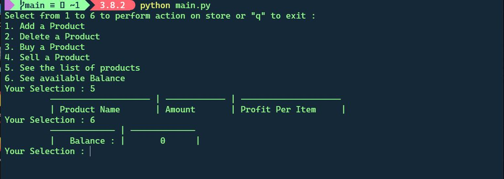
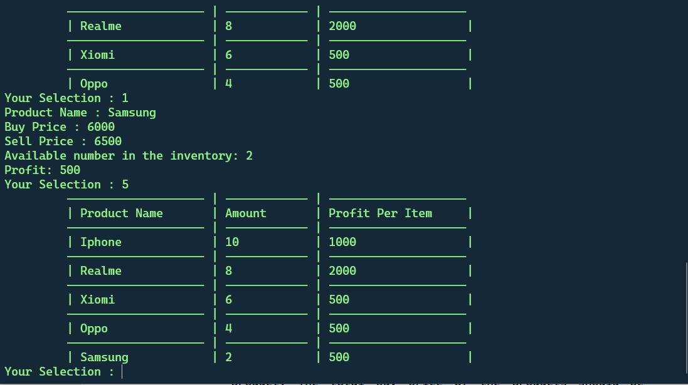
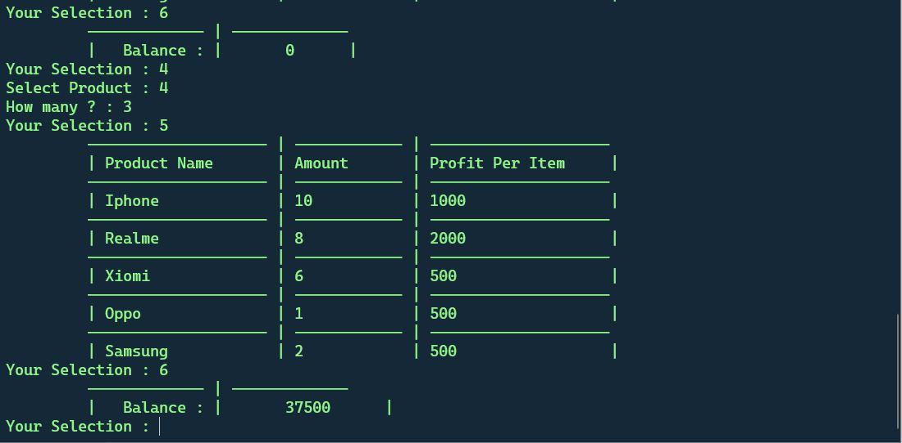
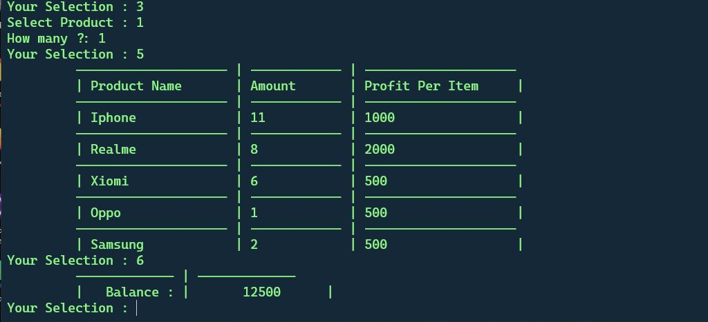
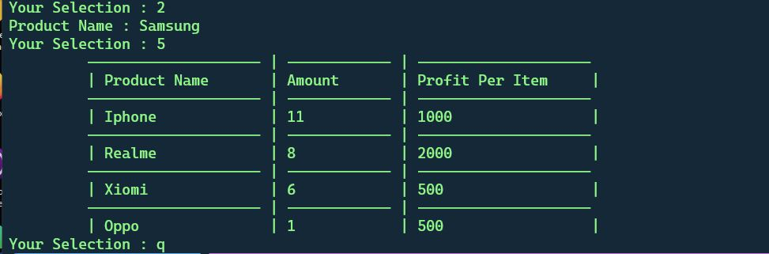

# Small-Business-Ledger
managing a shop's buying and selling products,Balance using OOP

> ## Initial State of Shop in terminal when Shop is empty & balance is also empty

> ## Shop's state and Balance After Adding 5 products

> ## Shop's state and Balance After Selling 3 Oppo Phones

> ## Shop's state and Balance after Buying 1 Iphone for my shop

> ## Shop's State After Deleting Samsung Phone

